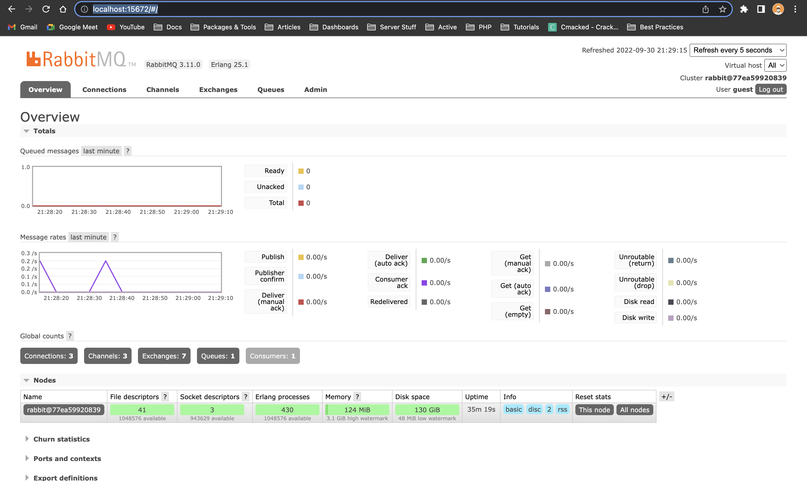

# Node-RabbitMQ

## Usage

Too stressed to be writing this but, I already included a version of RabbitMQ that has the management interface and prometheus and you can just run it with `docker-compose up -d` to save you the trouble of installing it or running `docker run ...`



## Run

Run the following command in the repo's root folder (don't forget to start the RabbitMQ server first with Docker)

```bash
npm start
```

You should get the following output (an `npm install` in both folders won't hurt too 🫣), which means that the servers are running fine:


## Endpoints

- `Publisher` - http://localhost:20000/publish
- `RabbitMQ MI` - http://localhost:15672
- `Prometheus` - http://localhost:15692

You'll find the logged events the client's `dist/logs` folder.

## Publishing events

You can send events to the publisher using the `POST` method on the `/publish` endpoint.


## Receiving events

The client/consumer is setup to receive events from the publisher and log them to files in text format.


### Disappointed?

Well, I am too but this is just to explore [RabbitMQ](https://www.rabbitmq.com/).
